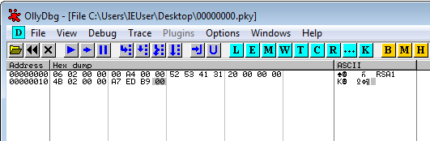
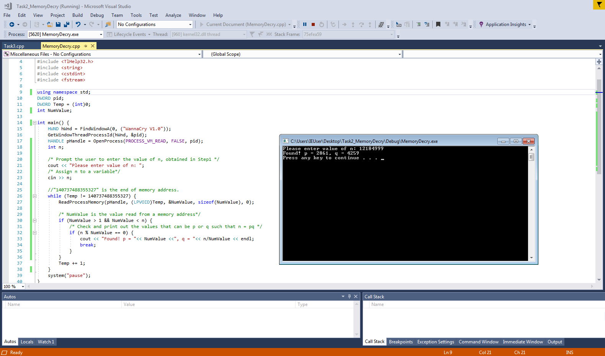
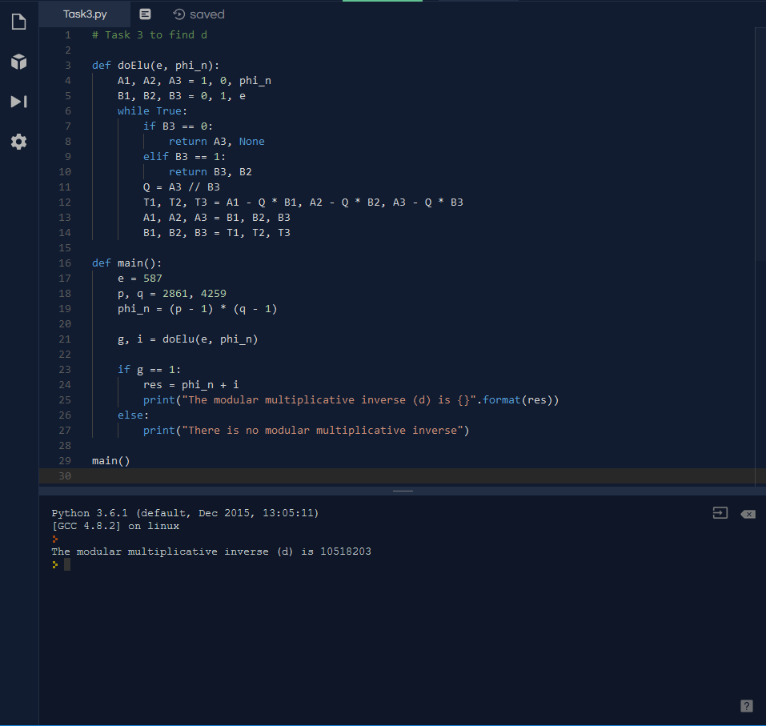
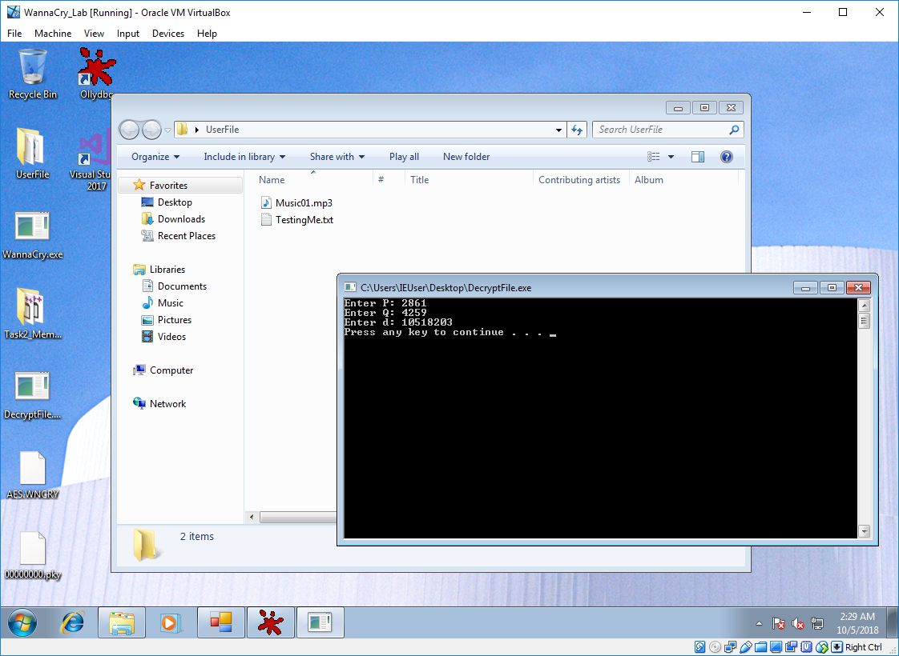

# COMP3334 Task 2

JAHJA Darwin, 16094501d

The screenshot below shows the content of the "00000000.pky" file generated by WannaCry.

Here, we can know that the public exponent *e* and the Modulus *n* are "4B 02 00 00" and "A7 ED B9 00" respectively, which both are in little-endian format. Converting them into decimal, we get:

**e** = 0x24B = 587

**n** = 0xB9EDA7 = 12184999

---
Then, by running the C++ program to search the main memory, we can get *p* and *q*.

The above screenshot show the runtime of the C++ program. Here,

**p** = 2861, **q** = 4259

---
After that,  we can calculate *d* which is the modular multiplicative inverse of *e*. I have written a python program for the calculation.

Here, **d** = 10518203.

---
Finally, we can decrypt the file using the value of *p*, *q* and *d*

