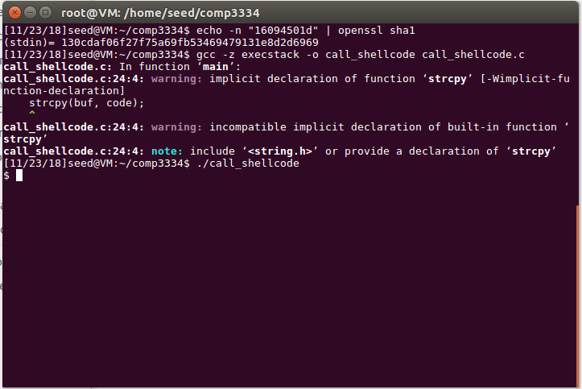
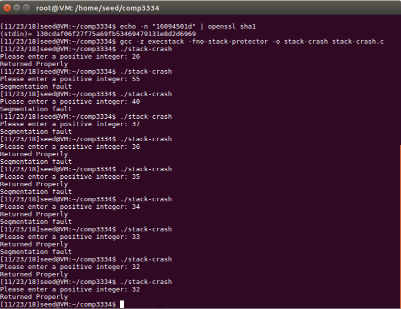

# COMP3334 Lab3

JAHJA Darwin, 16094501d

---

## Task 1

The output launches a shell.

## Task 2

The minimum value of n is 37. The error message is segmentation fault as the return address in the active stack frame of bof() is corrupted when n > 36. Thus, the "Returned Properly" will not be shown.
