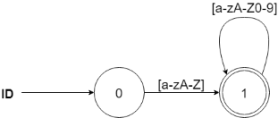
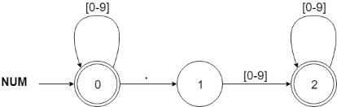
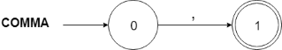
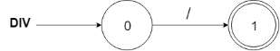

# COMP3438 Assignment 2

JAHJA Darwin, 16094501d

---

## 1. Regex

```tex
KEYWORD   -> var|begin|end
COMMA     -> ,
SEMICOLON -> ;
ASSIGN    -> =
PERIOD    -> \.
NUM       -> [0-9]*(\.([0-9]+))?
PLUS      -> +
MINUS     -> -
MUL       -> *
DIV       -> /
LBRACE    -> (
RBRACE    -> )
ID        -> [a-zA-Z][a-zA-Z0-9]*
```

## 2. Finite Automata (FA)

The following constructed minimized-FAs are used to identify each token type:

### KEYWORD & ID:



### NUM



### COMMA



### SEMICOLON


### ASSIGN


### PERIOD


### PLUS


### MINUS


### MUL


### DIV



### LBRACE


### RBRACE


