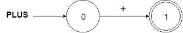
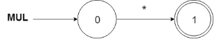
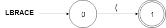

# COMP3438 Assignment 2

JAHJA Darwin, 16094501d

---

## 1. Regex

```tex
KEYWORD   -> var|begin|end
COMMA     -> ,
SEMICOLON -> ;
ASSIGN    -> =
PERIOD    -> \.
NUM       -> [0-9]*(\.([0-9]+))?
PLUS      -> +
MINUS     -> -
MUL       -> *
DIV       -> /
LBRACE    -> (
RBRACE    -> )
ID        -> [a-zA-Z][a-zA-Z0-9]*
```

## 2. Finite Automata (FA)

The following constructed minimized-FAs are used to identify each token type:

### KEYWORD & ID


A keyword is identifies by the above FA as an ID. Then, after an ID is obtained, the program will check a keyword table to see whether it is an ID or keyword.

In this way, the number of states can be reduced.











## 3. Program

### Functions

main()
