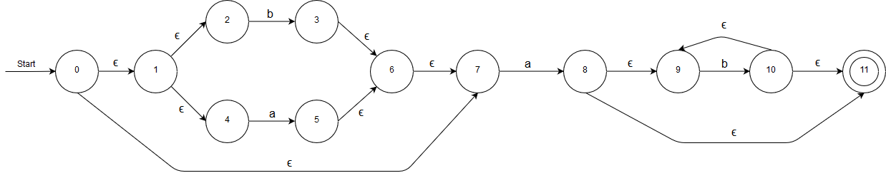
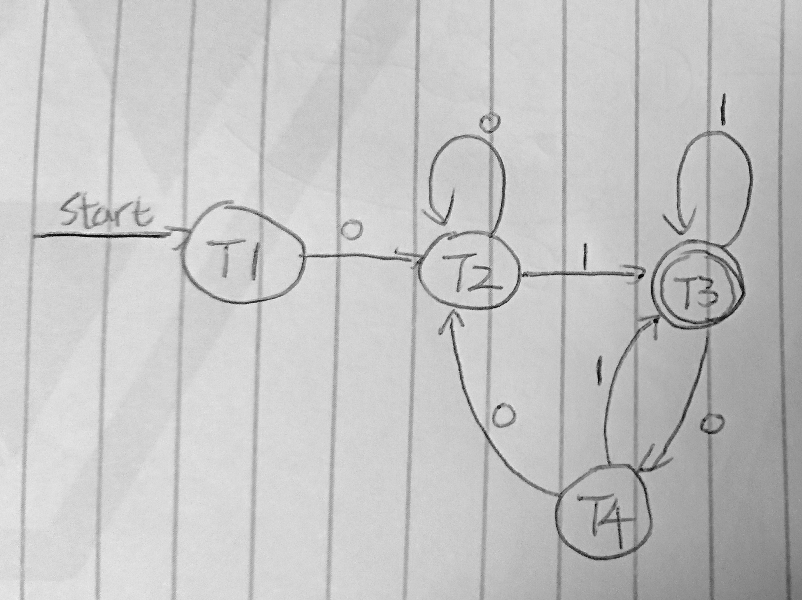

# COMP3438 Lab 9

JAHJA Darwin, 16094501d

---

## 1. Regex to NFA

Apply *Thompson’s construction* to get the NFA:

## 2. NFA to DFA

**T1** = $\epsilon$-closure(1) = {1,2,5,9,10}

move(T1, 0) = {3},  
$\epsilon$-closure(3) = {1,2,3,5,6,9,10} = T2

move(T1, 1) = {4,8},  
$\epsilon$-closure(4,8) = {1,2,4,5,**7**,8,9,10} = **T3**

move(T2, 0) = {3,10},  
$\epsilon$-closure(3,10) = {1,2,3,5,6,9,10} = T2

move(T2, 1) = {4,8,9},  
$\epsilon$-closure(4,8,9) = {1,2,4,5,**7**,8,9,10} = T3

move(T3, 0) = {3,8},  
$\epsilon$-closure(3,8) = {1,2,3,5,6,8,9,10} = T4

move(T3, 1) = {4,8},  
$\epsilon$-closure(4,8) = T3

move(T4, 0) = {3,10},  
$\epsilon$-closure(3,10) = T2

move(T4, 1) = {4,8,9},  
$\epsilon$-closure(4,8,9) = T3

Transition Table

|        | 0  | 1  |
|--------|----|----|
| **T1** | T2 | T3 |
| T2     | T2 | T3 |
| **T3** | T4 | T3 |
| T4     | T2 | T3 |

