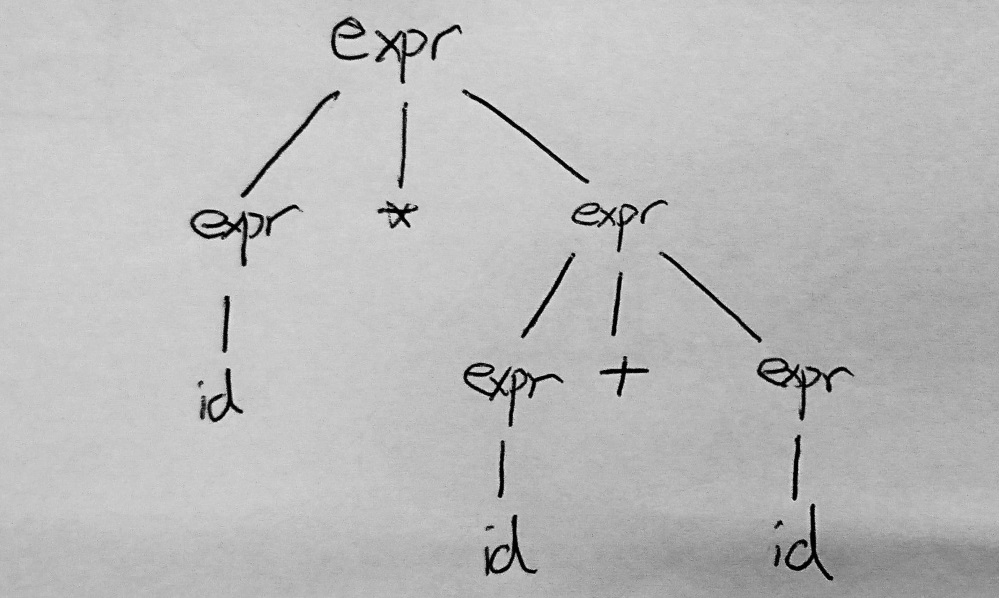
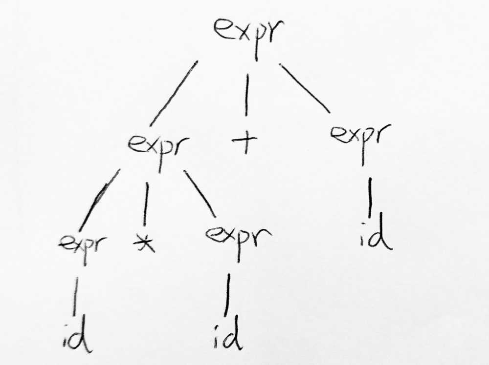

# COMP3438 Lab 10

JAHJA Darwin, 16094501d

---

# 1.

The 2 production rules are: $S\to aaaSbbb, S\to aa$. Thus, CFG for $L = \{a^{3n+2n}b^{3n}|n\ge 0\}$:

$$
G = \{N = \{S\}, T = \{a,b\}, S, P = \{S\to aaaSbbb|aa\}\}
$$

# 2.

**(a)** Leftmost derivation for $id*id+id$:
$$
expr \Rightarrow expr*expr \Rightarrow id*expr \Rightarrow id*expr+expr \\
\Rightarrow id*id+expr \Rightarrow id*id+id
$$

**(b)** Parse tree for (a)

**(c)** $G$ is ambiguous as the grammar can be represented by another parse tree:

