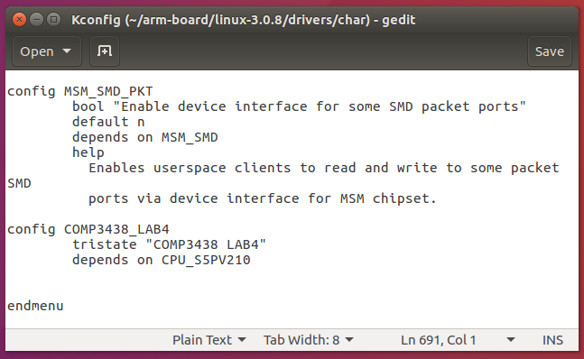

# Lab4 Report

JAHJA Darwin, 16094501d

## Setup the VM

1. Basic settings:


2. Network settings:


3. Make vdi file immutable:


4. Start the VM.

---

## Create a Character device driver

1. Put the 'comp3438_lab4.c' file in 'arm-board/linux-3.0.8/drivers/char/'


2. Open the 'arm-board/linux-3.0.8/drivers/char/Makefile' and add the following line at the end.

```tex
obj-$(CONFIG_COMP3438_LAB4) += comp3438_lab4.o
```


3. Open the "arm-board/linux-3.0.8/drivers/char/Kconfig" and add the following lines at the end before "endmenu".

```tex
...

config COMP3438_LAB4
    tristate "COMP3438 LAB4"
    depends on CPU_S5PV210

endmenu
```



4. In the terminal, run:

```bash
cd ~/arm-board/linux-3.0.8” and run 
make menuconfig
```


5. In the menu, Go to *Device Drivers > character devices > COMP3438 LAB4*. Press 'M', save and exit.


6. Run `make` to compile the driver. It will create the driver files in "arm-board/linux-3.0.8/drivers/char"


---

## Load the driver on the embedded board

1. Open putty and mount "/home/comp3438/arm-board" to the embedded board. And dynamically load the driver in kernel.

```bash
# Run in putty terminal
mount –t nfs 192.168.1.1:/home/comp3438/arm-board /mnt/nfs –o nolock
cd /mnt/nfs/linux-3.0.8/drivers/char
insmod comp3438_lab4.ko
```


2. Check if device driver is added to the system.

```bash
cat /proc/devices
```


3. Link the driver to a device file.

```bash
mknod /dev/lab4 c 250 1
```


Now, the device is attached to the file. we can read from the file using unix system calls.

---

## Read from the driver by writing C code

1. Put "comp3438_lab4_app.c" in 'arm-board/' and compile the code.

```bash
cd arm-board/
arm-linux-gnueabi-gcc -o comp3438_lab4_app comp3438_lab4_app.c
```


3. In putty terminal, go to "/mnt/nfs" and run the compiled file.

```bash
cd /mnt/nfs/
./comp3438_lab4_app
```


