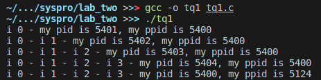
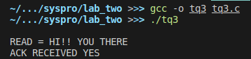
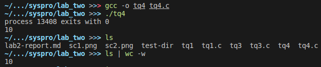
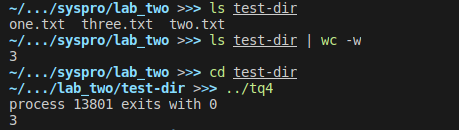

# Lab2 Report

JAHJA Darwin, 16094501d

## Q1.

**a)** 5 processes (including the current one) will be generated.

**b)** The output format for the program is:

```txt
i 0 - my pid is PID_C+1, my ppid is PID_C
i 0 - i 1 - my pid is PID_C+2, my ppid is PID_C
i 0 - i 1 - i 2 - my pid is PID_C+3, my ppid is PID_C
i 0 - i 1 - i 2 - i 3 - my pid is PID_C+4, my ppid is PID_C
i 0 - i 1 - i 2 - i 3 - my pid is PID_C, my ppid is B
```

Here is one of the possible outputs:

```txt
i 0 - my pid is 2582, my ppid is 2581
i 0 - i 1 - my pid is 2583, my ppid is 2581
i 0 - i 1 - i 2 - my pid is 2584, my ppid is 2581
i 0 - i 1 - i 2 - i 3 - my pid is 2585, my ppid is 2581
i 0 - i 1 - i 2 - i 3 - my pid is 2581, my ppid is 1607
```

Where PID_C = 2581 and its parent pid B = 1607.

**c)** Screenshot of the execution result:



---

## Q2.

Assuming that the block size is 2 KB and the pointer size is 4 bytes. The second part of an i-node consists of 12 direct pointers, 1 single indirect pointer, 1 double indirect pointer, and 1 triple indirect pointer.

Direct pointers:

- 12 direct pointers can point to 12 * 2KB = **24KB** of file

Single indirect pointer:

- Single indirect pointer will point to a block of direct pointers.
- A block can contain 2KB/4bytes = 512 pointers
- 512 direct pointers can point up to 512 * 2KB = 1MB of memory.
- Thus, Single indirect pointer can point to **1MB + 24KB** of file.

Double indirect pointer:

- Double indirect pointer will point to a block of single indirect pointers.
- A block can contain 2KB/4bytes = 512 single indirect pointers.
- 512 single indirect pointers can point up to 512 * 1MB = 512MB of memory.
- Thus, Double indirect pointer can point up to **512MB + 1MB + 24KB** of file.

Triple indirect pointer:

- Triple indirect pointer will point to a block of double indirect pointers.
- A block can contain 2KB/4bytes = 512 double indirect pointers.
- 512 double indirect pointers can point up to 512 * 512MB = 256GB of memory.
- Thus, Triple indirect pointer can point up to **256GB + 512MB + 1MB + 24KB** of file.

---

## Q3.

The purpose of this code segment is to demonstrate the use of pipe() function, which is used for communication between parent and child process.

In this program, the parent process first sends out the message "HI!! YOU THERE" to the child and waits for a response from the child.

When the child receives the message, it will prints out the message as "READ = HI!! YOU THERE", and sends back a "YES" response to the parent.

Finally, the parent receive the response from the child and prints out the response as "ACK RECEIVED YES".

Here is the screenshot of the execution result:



---

## Q4.

The purpose of this code segment is to count the number of non-hidden files in the shell's current directory.

In this program, the parent waits until the child finished executing the 2 commands using the *run2com()* function.

The child first execute the *ls* command and pass the outputs to the forked grandchild through dup2().

Then, the grandchild executes the *wc -w* command and outputs the number of non-hidden files in the current directory.

It can be replace by a single Unix shell command,

```bash
ls [optional:directory_location] | wc -w
```

Here is the screenshot of the execution result:




